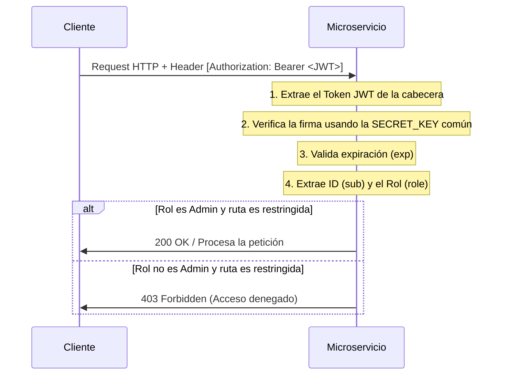

# Microservicio de Autenticación

Este microservicio se encarga de gestionar el registro, el inicio de sesión y la administración de los usuarios en la plataforma de Coworking. Implementa autenticación basada en tokens JWT (JSON Web Tokens) transmitidos mediante cabeceras HTTP Bearer.

---

## Tecnologías Utilizadas

*   **Lenguaje**: Python 3.11+
*   **Framework**: FastAPI
*   **ORM**: SQLAlchemy
*   **Seguridad**: JWT (PyJWT) y Hash de Contraseñas (pwdlib)
*   **Base de Datos**: PostgreSQL (a través del conector psycopg2)

---

## Endpoints de la API

Todos los endpoints que requieren autenticación esperan el token en la cabecera `Authorization: Bearer <token>`.

### 1. Endpoints Públicos

#### `POST /auth/register` (Registrar Usuario)
*   **Body (JSON)**:
    ```json
    {
      "name": "Jane Doe",
      "email": "jane@example.com",
      "phone": "+57 300-1234567",
      "password": "mi_contrasena_segura"
    }
    ```
*   **Respuesta (201 Created)**:
    ```json
    {
      "message": "Register Successful",
      "access_token": "eyJhbGciOiJIUzI1NiIsInR5cCI6IkpXVCJ9...",
      "token_type": "bearer",
      "user": {
        "id": 2,
        "name": "Jane Doe",
        "email": "jane@example.com",
        "phone": "+57 300-1234567",
        "role": "User",
        "created_at": "2026-05-23T19:00:00Z",
        "updated_at": "2026-05-23T19:00:00Z"
      }
    }
    ```

#### `POST /auth/login` (Iniciar Sesión)
*   **Body (JSON)**:
    ```json
    {
      "email": "jane@example.com",
      "password": "mi_contrasena_segura"
    }
    ```
*   **Respuesta (200 OK)**: Retorna el mismo formato que el registro, incluyendo el `access_token`.

---

### 2. Endpoints Protegidos (Cualquier Usuario Autenticado)

#### `GET /users/me` (Ver Mi Perfil)
*   **Headers**: `Authorization: Bearer <token>`
*   **Respuesta (200 OK)**: Datos del usuario autenticado.

#### `PUT /users/me` (Actualizar Mi Perfil)
*   **Headers**: `Authorization: Bearer <token>`
*   **Body (JSON)**: Igual al de registro.
*   **Respuesta (200 OK)**: Datos actualizados del usuario.

#### `DELETE /users/me` (Eliminar Mi Cuenta)
*   **Headers**: `Authorization: Bearer <token>`
*   **Respuesta (204 No Content)**.

---

### 3. Endpoints de Administrador (Solo Administradores)

#### `POST /users/admin` (Crear un nuevo Administrador)
*   **Headers**: `Authorization: Bearer <token_de_administrador>`
*   **Body (JSON)**: Datos del nuevo administrador.
*   **Respuesta (201 Created)**: Datos del administrador creado (con `role: "Admin"`).

#### `DELETE /users/{user_id}` (Eliminar a cualquier usuario)
*   **Headers**: `Authorization: Bearer <token_de_administrador>`
*   **Respuesta (204 No Content)**.

---

## Verificación de Usuarios y Roles 

Dado que se trata de una arquitectura de microservicios políglota (Go, Rust, Node.js), cualquier servicio del ecosistema puede verificar la autenticación del usuario de forma independiente (sin llamar constantemente al `AuthService` por red):



### Reglas para la verificación en cualquier lenguaje:
1.  **Extracción del Token**: Extraer el valor del string en la cabecera HTTP `Authorization`, eliminando el prefijo `"Bearer "`.
2.  **Verificación de la Firma**: Validar el token usando la clave simétrica compartida (`SECRET_KEY`) y el algoritmo (`ALGORITHM`, ej: `HS256`).
3.  **Chequeo de Expiración (`exp`)**: Validar que la fecha y hora actual sea menor que la marca de tiempo indicada en el campo `exp` del payload.
4.  **Autorización Basada en Roles (`role`)**: Inspeccionar el claim `role` dentro del payload. Si la ruta requiere privilegios elevados (ej. gestionar espacios) y el rol del token no es `"Admin"`, rechazar inmediatamente la petición con un código HTTP `403 Forbidden`.

---

## Sembrado (Seeder) del Administrador Inicial

Para crear el primer administrador del sistema e interactuar con los endpoints protegidos por primera vez, ejecuta el script de siembra provisto:

1.  Asegúrate de tener la base de datos de autenticación activa.
2.  Ejecuta el script interactivamente desde la carpeta del servicio:
    ```bash
    python3 seed.py
    ```
    *El script te solicitará los datos (Nombre, Email, Teléfono, Contraseña) y creará el registro automáticamente.*

3.  O ejecútalo de forma no interactiva (ideal para pipelines o Docker):
    ```bash
    python3 seed.py --name "Admin General" --email "admin@example.com" --phone "+57 300-1234567" --password "admin123"
    ```